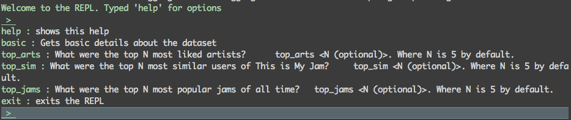
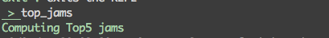
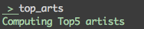

# Spotify Data take-home challenge: www.thisismyjam.com

Spark-based project to solve the challenge

## Requirements
- maven 3.5  
- Java 8  
- scala 2.12
- Apache Spark 2.2.0
- wget

If you use brew.sh on your mac. You can install them using:  
> $ brew install maven; brew install apache-spark

## Setup

I provide a Makefile to perform some common operations:

1. Downloading and preparing the data set. It should be unzipped on the 'archive' folder   
> $ make download  
or  
> $ ./scripts/dataset_download.sh

2. The project is based on maven. Thus, in order to create the distribution you need to:  
> $ mvn package  

This will create a fat jar *target/uber-jam-0.1.0.jar* that can be used with spark-submit

## Assumptions

In general, I assumed that the data (jams, likes, followers) were case-insensitive. Thus, I transformed everything to lower-case. Also, I removed some punctuation symbols: !"#$%&'()*+,-./:;<=>?@[\]^_`{|}~

## Processing the data.

1. Launch the spark job. You should use spark-submit in order to run the application. The entry point is the singleton `com.spotify.jam.MyJamApp` which accepts 5 arguments `USAGE: MyJamApp <jams> <likes> <followers> <output_folder> <num_partitions>`. For instance, running spark locally with 4 executors, using 4 partitions for the input data (assuming you have the dataset on the folder *archive*):  
> $ /path/to/spark-submit \-\-master local[4] \-\-class com.spotify.jam.MyJamApp target/uber-jam-0.1.0.jar archive/jams.tsv archive/likes.tsv archive/followers.tsv ./output 4    
2. The application is set up as a REPL-based command line interface (Read-Eval-Print loop). Thus, once you execute the spark application using spark-submit (see step 1), then you'll see a welcome message:   
3. What were the top 5 most popular jams of all time? You can answer this question using the **top_jams** repl option. Thus, when you're at the repl prompt, just type 'top_jams'. This will create a file *topJams.csv* in the folder you set as output folder.    
4. What were the top 5 most liked artists? Similarly, You can answer this using the **top_arts** repl option. Just type 'top_arts'. This will create a file *topArtists.csv* in the folder you set as output folder.   
5. What were the top 5 most similar users of This is My Jam? You can answer this using the **top_sim** repl option. Just type 'top_sim'. This will create a file *topSimUsers.csv* in the folder you set as output folder.

## Top 5 most similar users of This is My Jam: Approach

1. I represent each user using a vector representation as in the vector space model. Thus, each user will have a sparse vector (represented as a HashMap). Each element (key) on the vector (Map) is a track (Tuple(artist, title)) and the value for that element is defined as the number of times the user used the track as a jam. The number of times a user used a track as a jam is extracted from the Jams file. Thus a user is **<user_id, track_vector>**
2. I compute the cartesian product between each user, in order to create user pairs (user_id1, user_id2).
3. For each user pair, I used the cosine similarity to compute the similarity between two users (dot product of their track_vectors). Since I'm considering each user as a vector, then the cosine similarity gives a number of how similar are the vectors of the two users.  
4. Then I pick the 5 pair that has the largest positive cosine similarity.

Since I used the cartesian product this operation takes a lot of time and memory. 

## Results

You can find the results in CSV format located at the folder 'answers':  
answers:  
    - result1.csv: top 5 most popular jams.  
    - result2.csv: top 5 most liked artists.  
    - result3.csv: top 5 most similar users based on: vector space model + cosine similarity
